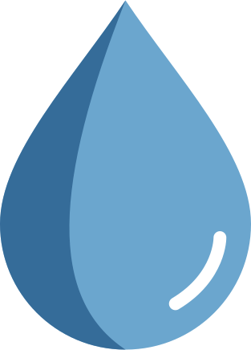

# Gocha - Bookmark Manager



*Una aplicación moderna y minimalista para gestionar tus bookmarks favoritos*


## 📋 Descripción

**Gocha** es una aplicación web que permite a los usuarios guardar, editar y eliminar sus bookmarks favoritos. La aplicación valida las URLs antes de almacenarlas y utiliza el localStorage del navegador para la persistencia de datos.

## ✨ Características

- 🔖 **Gestión completa de bookmarks**: Crear, editar y eliminar
- 🔍 **Búsqueda inteligente**: Encuentra tus bookmarks rápidamente
- 📄 **Paginación**: Navegación eficiente con 20 items por página
- 🗑️ **Eliminación masiva**: Borra todos los bookmarks con un clic
- ✅ **Validación de URLs**: Verifica que las URLs sean válidas antes de guardar
- 💾 **Persistencia local**: Los datos se guardan en localStorage
- 📱 **Diseño responsivo**: Funciona en dispositivos móviles y desktop

## 🛠️ Stack Tecnológico

- **Frontend Framework**: React 18.2.0
- **Build Tool**: Vite 4.1.1
- **Routing**: React Router DOM 6.8.0
- **Styling**: Sass/SCSS
- **HTTP Client**: Axios 1.3.2
- **Code Quality**: ESLint + Prettier

## 🚀 Instalación y Uso

### Prerrequisitos

- Node.js (versión 16 o superior)
- pnpm (recomendado) o npm

### Instalación

1. **Clona el repositorio**

   ```bash
   git clone <url-del-repositorio>
   cd gocha
   ```

2. **Instala las dependencias**

   ```bash
   pnpm install
   # o
   npm install
   ```

3. **Inicia el servidor de desarrollo**

   ```bash
   pnpm dev
   # o
   npm run dev
   ```

4. **Abre tu navegador** en `http://localhost:3000`

### Scripts disponibles

```bash
pnpm dev      # Inicia el servidor de desarrollo
pnpm build    # Construye la aplicación para producción
pnpm preview  # Previsualiza la build de producción
pnpm format   # Formatea el código con Prettier
pnpm lint     # Ejecuta ESLint y corrige errores automáticamente
```

## 📱 Funcionalidades

### Historias de Usuario

- **🏠 Página principal**: Los usuarios acceden a `/` para comenzar el flujo
- **➕ Crear bookmark**: Los usuarios pueden agregar enlaces para guardarlos como bookmarks
- **✏️ Editar bookmark**: Los usuarios pueden editar bookmarks previamente guardados
- **🗑️ Eliminar bookmark**: Los usuarios pueden eliminar bookmarks individuales
- **🗑️ Eliminar todos**: Los usuarios pueden eliminar todos los bookmarks con un solo botón
- **📄 Navegación**: Los usuarios pueden navegar por las diferentes páginas de la lista
- **🔍 Buscar**: Los usuarios pueden buscar bookmarks específicos en la lista

## 📊 Modelo de Datos

### Bookmark

```javascript
{
  id: Date,        // Timestamp único como identificador
  url: String      // URL del bookmark (validada)
}
```

## 🏗️ Estructura del Proyecto

```text
src/
├── components/
│   ├── Bookmarks/          # Componentes relacionados con bookmarks
│   ├── Navigation/         # Componentes de navegación (Brand, Pagination)
│   ├── Tokens/            # Componentes reutilizables (Buttons)
│   └── Utils/             # Utilidades (Form, SearchBar, Error)
├── contexts/              # React Context para manejo de estado global
├── pages/                # Páginas principales de la aplicación
├── styles/               # Arquitectura SASS organizada
│   ├── abstracts/        # Variables, mixins, funciones
│   ├── base/            # Reset, base, tipografía
│   ├── components/      # Estilos de componentes
│   └── pages/          # Estilos de páginas
└── assets/              # Imágenes, iconos y recursos estáticos
```

## 🤝 Contribución

1. Fork el proyecto
2. Crea una rama para tu feature (`git checkout -b feature/AmazingFeature`)
3. Commit tus cambios (`git commit -m 'Add some AmazingFeature'`)
4. Push a la rama (`git push origin feature/AmazingFeature`)
5. Abre un Pull Request

## 📝 Licencia

Este proyecto está bajo la licencia MIT. Ver el archivo `LICENSE` para más detalles.

## 🔮 Roadmap

- [ ] Sincronización con la nube
- [ ] Categorías y tags para bookmarks
- [ ] Importar/exportar bookmarks
- [ ] Modo oscuro
- [ ] PWA (Progressive Web App)
- [ ] Favoritos y sistema de puntuación

---

*Hecho con ❤️ por el equipo de Gocha*
